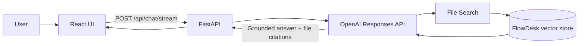

# FlowDesk Support — OpenAI RAG Assistant

A full-stack customer-support assistant that answers questions from a fictional SaaS help center and cites the supporting articles. The project demonstrates retrieval-augmented generation without hiding the core workflow behind an orchestration framework.

## What it demonstrates

- A React and TypeScript chat interface with streaming, citations, voice input, and inline media
- Email/password registration and login with protected chat access
- Salted PBKDF2 password hashes, expiring signed JWTs, and SQLite user storage
- Persistent chat boards with multiple stored user and assistant messages
- Per-user board ownership, rename/delete controls, and saved citations
- A typed FastAPI backend that keeps the OpenAI API key server-side
- OpenAI Responses API with hosted File Search and vector stores
- Smart routing between general answers, File Search, Web Search, and attachment analysis
- Private multipart uploads and in-chat previews for common document and image formats
- Idempotent ingestion of 18 Markdown help-center articles
- A fixed 40-question benchmark covering facts, paraphrases, error codes, and refusals
- Mocked unit/integration tests plus an optional live OpenAI test

## Architecture



During setup, `backend.ingest` uploads the knowledge-base files and OpenAI indexes them in a hosted vector store. At question time, the model invokes File Search, receives relevant chunks, and produces a grounded answer with file citations.

## Quick start

Prerequisites: Python 3.11+, Node.js 20+, an OpenAI API key, and API credits.

### 1. Backend setup

```bash
python -m venv .venv
# Windows PowerShell
.venv\Scripts\Activate.ps1
pip install -e ".[dev]"
Copy-Item .env.example .env
```

The editable install is required for PDF and Office attachments. If `/api/health` reports
`attachment_support: false`, activate `.venv`, rerun `python -m pip install -e ".[dev]"`, and
restart Uvicorn. Restart the Vite frontend after attachment API changes so both servers use the
same payload format.

Put your key in `.env`:

```env
OPENAI_API_KEY=your_key_here
OPENAI_VECTOR_STORE_ID=
OPENAI_MODEL=gpt-5-mini
FRONTEND_ORIGIN=http://localhost:5173
AUTH_SECRET=replace_with_a_long_random_secret
AUTH_DATABASE_PATH=flowdesk.db
# Local development only; never use this in a deployed environment:
# ALLOW_INSECURE_AUTH_SECRET=true
```

Never commit `.env`; it is ignored by Git.

### 2. Index the help center

```bash
python -m backend.ingest
```

The command creates or reuses the FlowDesk vector store, uploads missing articles, waits for indexing, and writes the non-secret store ID to `vector_store.json`. Use `--recreate` when you intentionally want a fresh store.

### 3. Start the app

In one terminal:

```bash
uvicorn backend.main:app --reload --port 8001
```

In another terminal:

```bash
cd frontend
npm install
npm run dev
```

Open [http://localhost:5173](http://localhost:5173). FastAPI's interactive API documentation is at [http://localhost:8001/docs](http://localhost:8001/docs).

## API

| Method | Route | Purpose |
|---|---|---|
| `GET` | `/api/health` | Reports readiness without exposing secrets |
| `GET` | `/api/sample-questions` | Returns three recruiter-friendly prompts |
| `POST` | `/api/auth/register` | Creates an account and returns a bearer token |
| `POST` | `/api/auth/login` | Authenticates an account and returns a bearer token |
| `POST` | `/api/auth/forgot-password` | Sends a time-limited reset link without exposing account existence |
| `POST` | `/api/auth/reset-password` | Verifies a single-use token and saves a new password |
| `GET` | `/api/auth/me` | Returns the authenticated user |
| `GET` | `/api/boards` | Lists the signed-in user's chat boards |
| `POST` | `/api/boards` | Creates a new chat board |
| `GET` | `/api/boards/{id}` | Loads a board and all its messages |
| `PATCH` | `/api/boards/{id}` | Renames a board |
| `DELETE` | `/api/boards/{id}` | Deletes a board and its messages |
| `POST` | `/api/chat` | Adds a question and grounded answer to a board |
| `POST` | `/api/chat/stream` | Streams an answer and saves it after completion |
| `GET` | `/api/search` | Searches the signed-in user's saved messages |
| `POST` | `/api/uploads` | Uploads one temporary attachment with multipart data |
| `DELETE` | `/api/uploads/{id}` | Cancels and deletes a temporary upload |
| `GET` | `/api/attachments/{id}` | Privately previews a persisted PDF or image |
| `GET` | `/api/attachments/{id}/preview` | Returns a private text or Office preview |
| `GET` | `/api/media/{id}` | Returns authenticated generated media |

Generate a strong authentication secret before running the app:

```bash
python -c "import secrets; print(secrets.token_urlsafe(48))"
```

Password-reset emails use SMTP. For Gmail, enable two-step verification and put a Google App
Password in `SMTP_PASSWORD`; do not use the normal account password. Configure `SMTP_HOST`,
`SMTP_PORT`, `SMTP_USERNAME`, `SMTP_PASSWORD`, and `SMTP_FROM_EMAIL` in `.env`.

The browser keeps the token in `sessionStorage`, so signing out or closing the browser session clears it. Passwords are never stored directly: the backend stores salted PBKDF2-SHA256 hashes in the ignored `flowdesk.db` SQLite file. The same database contains `chat_boards` and `chat_messages`; foreign keys enforce user ownership and automatically remove messages when their board is deleted.

Example response:

```json
{
  "answer": "Invitations expire after seven days.",
  "citations": [
    {"filename": "02-invite-team-members.md", "label": "Invite Team Members"}
  ]
}
```

## Tests

```bash
pytest --cov=backend
cd frontend
npm test
npm run lint
npm run build
```

Backend tests mock OpenAI, so they do not spend API credits. The optional live test runs only when both `OPENAI_API_KEY` and `OPENAI_VECTOR_STORE_ID` are exported in the environment.

## Evaluation

After ingestion, run:

```bash
python -m evaluation.run_evaluation
```

The report is saved to `evaluation/latest_results.json`. Each case includes a manually reviewed
gold-standard `expected_answer`. The report measures citation accuracy and safe
unsupported-question handling. Unsupported answers pass only when they explicitly warn that the
detail is not confirmed by FlowDesk documentation and do not cite a document. Review answer
correctness manually because a correct citation does not guarantee a correct answer. Set each
result's `manual_correct` field and rerun with `--rescore`; answer accuracy remains unavailable
until all evaluated answers are reviewed.

| Metric | Target | Measured |
|---|---:|---:|
| Answer correctness (manual review) | ≥85% | Run evaluation first |
| Citation accuracy | ≥90% | Run evaluation first |
| Unsupported handling accuracy | 100% | Run evaluation first |

## Cost and limitations

- OpenAI charges for model tokens, File Search calls, and vector-store usage according to the current account pricing.
- Retrieval and chunking are managed by OpenAI, which keeps the app simple but provides less tuning control than a custom vector database.
- SQLite and local file storage target a single-server résumé deployment, not horizontal scaling.
- Video generation is disabled because the previously configured Sora 2 API was retired.
- Temporary uploads expire after one hour and are also cleaned by a scheduled backend task.
- Authentication and chat history are included; email verification, password reset, and human-agent handoff are not.
- The knowledge base describes a fictional product and must not be treated as a real service policy.

## Suggested résumé bullet

> Built a full-stack RAG customer-support assistant using React, FastAPI, OpenAI Responses API, and hosted vector search, achieving **X% answer accuracy** and **Y% citation accuracy** across a fixed 40-question evaluation set.

Replace Y with the measured citation score. Replace X only after every result has a manual
correctness decision and `resume_answer_accuracy_ready` is `true`.

## Further reading

- [OpenAI Responses API](https://developers.openai.com/api/reference/resources/responses/methods/create)
- [OpenAI vector-store search](https://developers.openai.com/api/reference/python/resources/vector_stores/methods/search)
- [GPT-5 mini](https://developers.openai.com/api/docs/models/gpt-5-mini)
